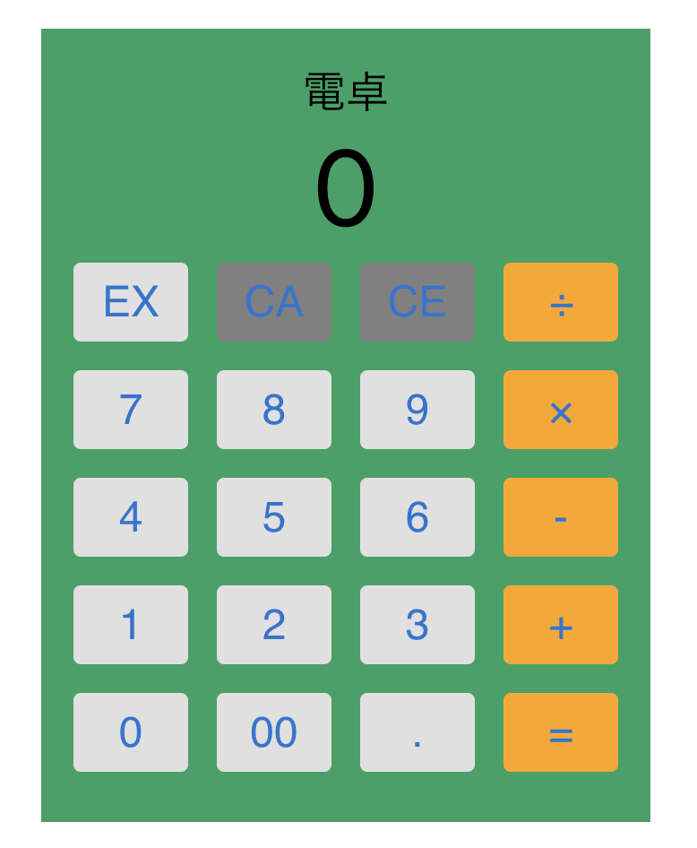

# 電卓機能

電卓機能を実装しました。基本的な電卓の機能のみ搭載されています。
[GitHub Actions](https://docs.github.com/ja/actions) で自動デプロイは実装済みです。

今回実装した[電卓](https://tyometarou.github.io/calculator/)

## 使用技術

[create-react-app](https://create-react-app.dev/)

[MUI](https://mui.com/)

[jest](https://jestjs.io/ja/)

[TestingLibrary](https://testing-library.com/docs/react-testing-library/intro/)

## 実行コマンド

### `npm start`

Runs the app in the development mode.\
Open [http://localhost:3000](http://localhost:3000) to view it in the browser.

The page will reload if you make edits.\
You will also see any lint errors in the console.

### `npm test`

Launches the test runner in the interactive watch mode.\
See the section about [running tests](https://facebook.github.io/create-react-app/docs/running-tests) for more information.

## 技術選定理由

① 　[create-react-app](https://create-react-app.dev/)
　特に NextJs でやる動機もなかった。（SEO とか SSR をする気もなかった。）
公式で create-react-app が消えていたので
[vite](https://ja.vitejs.dev/)に変えるのはアリかもしれないです。

② 　[MUI](https://mui.com/)　
触ったことがなかったので使ってみました。CSS フレームワークは一通り触ってみましたが、合意が取れて、デザイナーと正しく協議ができて、パフォーマンスに大きく影響がでなければ何でもいいやという心境です。

③ 　[jest](https://jestjs.io/ja/)

他に選択肢がなかったです。

④ 　[TestingLibrary](https://testing-library.com/docs/react-testing-library/intro/)

他に選択肢がなかったです。
